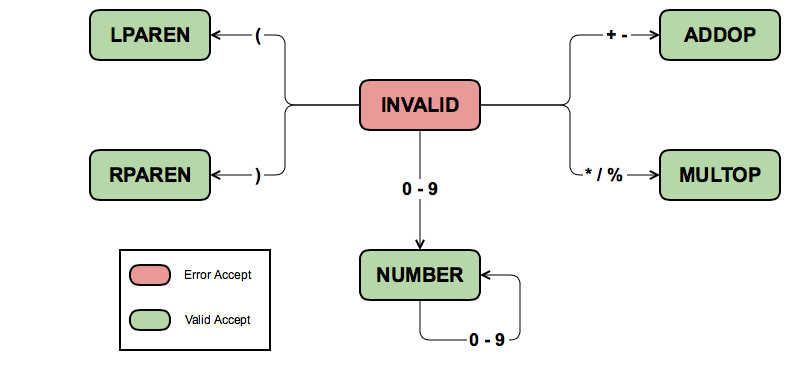

# COMP 232 Lab 5 - Transition Table Scanner

Download [this project](./lab\_5\_scanner\_transition\_table.zip), which will serve as a starting point for your lab.

In the previous lab, we build a specific scanner for a simple language. In this lab, we will generalize what we learned in the previous lab; we will encode descriptions of finite state machines in table format as **transition tables**.

Consider the following grammar for basic arithmetic expressions:

```
<expr> ::= <term> | <expr> <addop> <term>
<term> ::= <factor> | <term> <multop> <factor>
<factor> ::= <number> | <addop> <factor> | ( <expr> )
<number> ::= <digit> | <number> <digit>

<addop> ::= + | -
<multop> ::= * | / | %
<digit> ::= 0 | 1 | 2 | 3 | 4 | 5 | 6 | 7 | 8 | 9
```

We can quickly pick out the tokens:

* number
* addop
* multop
* left parenthesis (lparen)
* right parenthesis (rparen)

## FSA

From here, we can design a finite state machine (or finite state automata, FSA for short) for tokenization:



Note that in the figure above, the `INVALID` state is the starting state.

There are a few simplifying shortcuts taken in the notation for the FSA above and which you will need to follow in your FSA design for your designed machines to work with the provided code later on:

* All states are accepting states; any state which would be a "reject" state in most pattern-recognizing FSAs is instead an "error accept" state, meaning the string which would be rejected is instead accepted and tokenized, but tokenized as an invalid token.
* Any characters not represented by a transition are assumed to lead to acceptance in the current state. If the current state is a "valid accept" state, then the offending character should be assumed to be part of the next token (and thereby returned to the input stream). If, on the other hand, the current state is an "error accept", this means the offending character is part of the current (invalid) token (so it is not returned to the input stream).

The assumptions above allow for simpler (smaller) FSAs which can handle invalid inputs.

## Transition Table

We can now encode this FSA in a table. We will first perform the encoding in a human-readable fashion, and then discuss the specifics of encoding it for use with the utilities provided in the lab download.

The first thing we must do is enumerate all of the types of tokens that can be returned, and all of the states in our machine. The two are 1-1 in this example, but that is not always the case!

**token types**:

* `INVALID_TOKEN`
* `NUMBER_TOKEN`
* `ADDOP_TOKEN`
* `MULTOP_TOKEN`
* `LPAREN_TOKEN`
* `RPAREN_TOKEN`

**machine states**:

* `INVALID_STATE`
* `NUMBER_STATE`
* `ADDOP_STATE`
* `MULTOP_STATE`
* `LPAREN_STATE`
* `RPAREN_STATE`

Next, we need to partition the characters used as machine transitions into character classes.

**character classes**:

* `0-9`
* `+ -`
* `* / %`
* `(`
* `)`
* `\n \t\r`
* `other`

Most of the character classes above should be intuitive based on the FSA. Note the two extra classes, at the bottom. The first consists of the newline character, the space character, the tab character, and the carriage return character. This denotes the set of white space characters. For simplicity's sake, white space was not included in the FSA. White space characters are assumed to not be part of any token. They they may be used to signify the end of a token, however; the string `1 1` would be tokenized as two number 1's, whereas `11` would be tokenized as a single number 11. The second extra character class is for any characters that do not fall into any of the other classes. Generally, when a character in this class (i.e. not in any other class) is encountered, it is either evaluated independently as an invalid token or it is evaluated as the end of an invalid token.

Finally, we can represent the FSA as a transition table:

                    | **`0-9`**   | **`+ -`**     | **`* / %`**    | **`(`**        | **`)`**        | **`\n \r\t`** | **`other`** |                 |
:------------------ |:-----------:|:-------------:|:--------------:|:--------------:|:--------------:|:-------------:|:-----------:| ---------------:|
**`INVALID_STATE`** | `INT_STATE` | `ADDOP_STATE` | `MULTOP_STATE` | `LPAREN_STATE` | `RPAREN_STATE` | *skip*        | *error*     | `INVALID_TOKEN` |
**`NUMBER_STATE`**  | `INT_STATE` | *accept*      | *accept*       | *accept*       | *accept*       | *accept*      | *accept*    | `NUMBER_TOKEN`  |
**`ADDOP_STATE`**   | *accept*    | *accept*      | *accept*       | *accept*       | *accept*       | *accept*      | *accept*    | `ADDOP_TOKEN`   |
**`MULTOP_STATE`**  | *accept*    | *accept*      | *accept*       | *accept*       | *accept*       | *accept*      | *accept*    | `MULTOP_TOKEN`  |
**`LPAREN_STATE`**  | *accept*    | *accept*      | *accept*       | *accept*       | *accept*       | *accept*      | *accept*    | `LPAREN_TOKEN`  |
**`RPAREN_STATE`**  | *accept*    | *accept*      | *accept*       | *accept*       | *accept*       | *accept*      | *accept*    | `RPAREN_TOKEN`  |


Let's explore the transition table above.

The left-most column represents the current state of the machine. The top row represents the character class of the new character being processed. The contents of the table denote what action should be taken if the machine is in any state when it encounters a character from any class.

For instance, the `INT_STATE` in the second column from the left and second row from the top means that if the FSA is in the `INVALID_STATE` and it encounters a digit `0-9`, it should transition to the `INT_STATE`.

While tokenizing, a buffer is used to hold all of the characters comprising the token being constructed. Whenever a state transition happens, the new character is added to this buffer, so when the token is done being constructed its entire value (in string form) is in the buffer.

Finally, the right-most column denotes which type of token should be returned if a token is *accepted* while the state machine is in the corresponding row's state.

Other than state transitions, there are three keywords in the table, each of which denotes a unique action:

* *accept* :
	* The contents of the buffer form a valid token.
	* The new character is not part of this valid token.
	* The new character is put back on the input stream (to be read as the start of the next token).
	* The contents of the buffer can be used to create the new token (with the appropriate type from the right-most column).
* *skip*:
	* The character that was just read is not part of any token, but does not denote the end of a token either.
	* Nothing needs to be done; move on to the next character.
	* This is generally only used for white space in the `INVALID_STATE`; when white space is encountered in a different state, it generally signifies the end of a token which must be returned with an *accept*.
* *error*
	* The contents of the buffer (if there are any), with the addition of the new character, form an invalid token.
	* The new character (which is part of this invalid token) should be added to the buffer.
	* Then, an invalid token can be constructed with the contents in the buffer.

## Encoding the Transition Table

Once a transition table has been conceived, it can be written in a more concise format for use as the definition of a tokenizer.

The code provided in the lab handout takes tables exclusively in a very specific format. You'll want to open `table_1.txt` in the `tables` folder in the lab download, to read through it alongside this format:

* Line 1 consists as a single character, to be used as a delimiter later on in the table.
	* Choose a character that won't appear in the grammar, in `table_1.txt` it is the comma.
* Line 2 consists of three integers, separated by spaces. These are (respectively):
	* The number of token types (including `INVALID_TOKEN`).
	* The number of states in the machine (including `INVALID_STATE`).
	* The number of character
		* This includes any classes defined by inclusion, including the white space character class.
		* This does not include the `other` class, into which all unused characters fall.
* Line 3 is a list of the names of all token types.
	* They are separated by the delimiter you listed on line 1.
	* Unless either your delimiter is a space or your token types' names include spaces, you should not include spaces on this line.
	* This is the string used to represent the token type, and will be what is printed as the token type in the output.
	* The first token type listed is the type that will be assigned to invalid inputs, so it should be given a name like `INVALID_TOKEN`
	* Escape sequences in token type names are not supported.
* Line 4 is a list of the names of all states in the FSA.
	* Formatted the same as line 3, names separated by delimiters.
	* These names will never be printed, so they don't need to be pretty. Mine are descriptions, but integer names would work fine here.
	* Like token type names, state names do not support escape sequences.
* Line 5 is a list of all character classes, again separated by the delimiter.
	* The only escape sequences which are supported for use in character classes are `\n`, `\t`, and `\r`. If you wish to use other escape sequences in a character class, you'll need to edit `scanner.c` (ask and I'll show you where).
* The remaining lines encode the transition table itself. That is, they hold the contents of the table above.
	* Each line holds a row of the transition table.
	* The elements of a row are states or actions, separated by the delimiter (no extra spaces).
	* The left-most column (denoting which state the machine is in) is omitted. The first row should represent the first state listed on line 4, and so on.
	* The top-most row (denoting the character classes) is also omitted. The first column is for the first character class listed on line 5, and so on.
* As a final touch, the transition table should end with a blank line.

You'll notice, reading through `table_1.txt`, that some abbreviations have been made; `a` stands for *accept*, `s` for *skip* and `e` for *error*. This also means that `a`, `s` and `e` cannot be used as delimiters, nor can they be used as the names of states or token types.

## TASK 1:

Expand the FSA and transition table above to work for the following grammar:

```
<expr> ::= <term> | <expr> <addop> <term>
<term> ::= <factor> | <term> <multop> <factor>
<factor> ::= <number> | <addop> <factor> | ( <expr> )
<number> ::= <int> | <float>

<int> ::= <digit> | <int> <digit>
<float> ::= <digit>. | <digit> <float> | <float> <digit>

<addop> ::= + | -
<multop> ::= * | / | %
<digit> ::= 0 | 1 | 2 | 3 | 4 | 5 | 6 | 7 | 8 | 9
```

Then, modify `table_1.txt` (in the `tables` folder in the lab download) to match your modifications.

Finally, modify `input_1.txt` (in the `inputs` folder) to test your new table.

Your submission documentation should include your test inputs alongside their corresponding outputs. It should also include the FSA, which may be a photo of a hand-drawn picture (which you can make in groups on the whiteboard in class), but it can be made using diagram drawing utilities like Gliffy if you prefer. Regardless of how the table is made, it must be neat and readable to receive credit.

## TASK 2:

Create an FSA and transition table for the following grammar:

```
<program> ::= <statement> | <program> <statement>
<statement> ::= <assignStmt> | <repeatStmt> | <printStmt>

<assignStmt> ::= <id> = <expr> ;
<repeatStmt> ::= repeat ( <expr> ) <stmt>
<printStmt> ::= print <expr> ;

<expr> ::= <term> | <expr> <addOp> <term>
<term> ::= <factor> | <term> <multOp> <factor>
<factor> ::= <id> | <number> | <factor> | <addop> <factor> | ( <expr> )
<number> ::= <int> | <float>

<int> ::= <digit> | <int> <digit>
<float> ::= <digit>. | <digit> <float> | <float> <digit>

<id> ::= <letter> | <identifier> <letter> | <identifier> <digit>

<addOp> ::= + | -
<multOp> ::= * | / | %
<digit> ::= 0 | 1 | 2 | 3 | 4 | 5 | 6 | 7 | 8 | 9
<letter> ::= a | b | ... | z | A | B | ... | Z
```

Your table should be put in a file called `table_2.txt` in the `tables` folder in your lab. Construct test cases for your table and put them in `input_2.txt` in the `inputs` folder.

Again, include your test inputs alongside their outputs and your FSA in your documentation.
